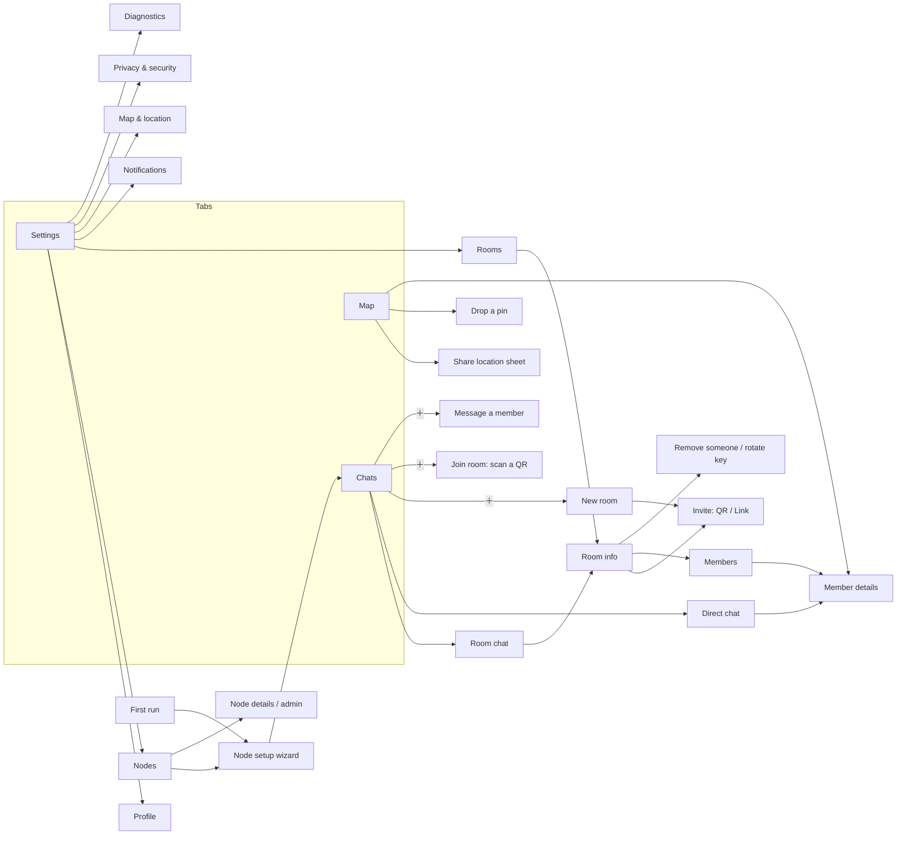
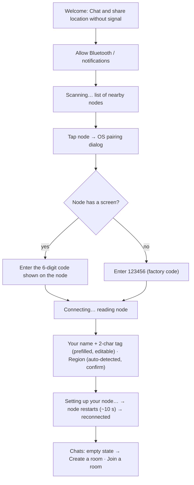
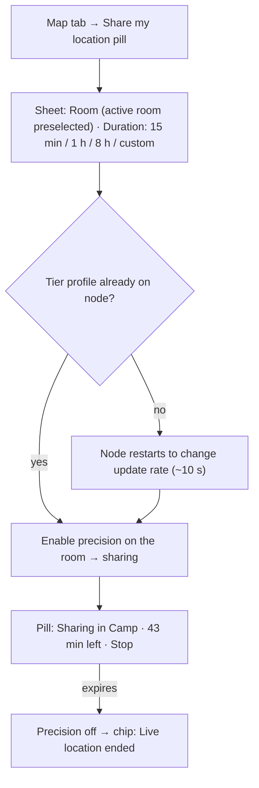
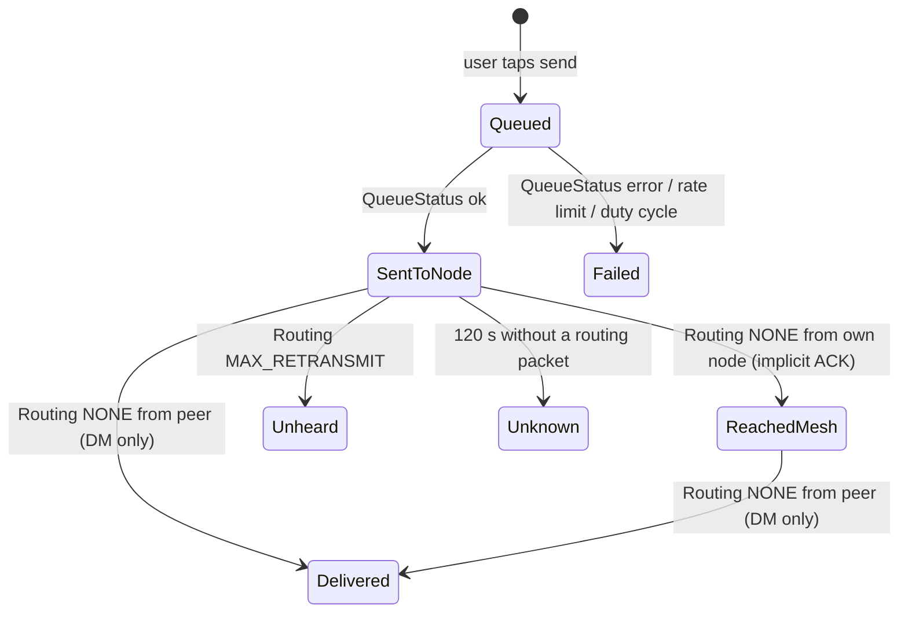

# Firepit (MeshChat) — UI/UX Design & Flow Verification

**Companion to:** `meshchat-app-design.md` (product design, rev 2) and `meshchat-implementation-guide.md` (protocol/firmware facts, rev 1)
**Product name:** Firepit (store, in-app title). "MeshChat" below is the internal protocol name.
**Platforms:** iOS (SwiftUI) and Android (Jetpack Compose), native, one shared design language
**Status:** UX design rev 2 — flows verified against firmware 2.7/2.8; decisions locked 2026-09-09 (§11.4, guide §9, `meshchat-v1-scope.md`)

---

## 1. Purpose and inputs

This document defines what the user sees and does. It takes the feature set from the design doc, the constraints from the implementation guide, and the brief for this revision:

- Familiar: it should feel like WhatsApp — chats list, bubbles, group info, invite by QR/link.
- Simple: automate every setting that can be derived; expose only decisions the user must make.
- Nodes: connect one or more nodes in a simple way; a node is **Personal**, **Base**, or **Router**.
- Core loop: connect node → create or join a room → chat.
- Three tabs: **Chats** (rooms and direct), **Map**, **Settings**.
- Beautiful, minimal, elegant.

Section 11 verifies the proposed flow against firmware reality and mobile best practice, and lists the adjustments made.

---

## 2. Design principles

1. **Familiar surface, honest semantics.** Borrow WhatsApp's layout, not its promises. A LoRa mesh cannot show "online", "read", or guaranteed delivery. Every indicator in MeshChat means exactly what the radio can prove (see §7.2 and §10).
2. **Zero-config by default.** Region, names, radio profile, telemetry, primary channel, hop limit, precision, favorites: derived or fixed. The user answers at most three questions to get a working node (§8).
3. **One primary action per screen.** Chats → write; Map → share/see; Settings → manage. The rest lives behind the room info screen and long-press menus.
4. **Local-first, latency-honest.** Everything the user does appears instantly; the mesh catches up. Delays and failures are shown as states, never as spinners that block.
5. **Quiet.** No alert popups for battery, signal, or staleness. Visual indicators only. The only interrupting notification is a message, an alert, or a location request.
6. **Explain the trust model once, where it matters.** Room info explains keys and invites in two sentences; ticks explain themselves on long-press. No security lectures in the main flow.
7. **Accessible and calm.** 44 pt targets, Dynamic Type, 4.5:1 contrast, colour never the only signal, reduced motion respected, RTL-ready.

---

## 3. People and top tasks

| Who | Top tasks | Frequency |
|---|---|---|
| Group member (most users) | read/write in a room, see who is where, share my location for a while, DM someone, drop a pin | constant |
| Organiser (one or two per group) | create room, invite people (QR at the meeting point, link for late arrivals), place a Base node at camp, occasionally remove someone | setup + rare |
| Everyone, once | pair their node, set name and region | once per node |

Design consequence: the first-run flow and the room invite flow get the most polish; node administration is thorough but tucked under Settings.

---

## 4. Information architecture

### 4.1 Tabs

| Tab | Purpose | Primary action |
|---|---|---|
| **Chats** | unified list of rooms and direct chats (filter: All · Rooms · Direct) | New chat (FAB / ＋): New room · Join room · Message a member |
| **Map** | everyone by name and colour, pins, live-location control | Share my location (floating pill) |
| **Settings** | profile, nodes, rooms, notifications, map, privacy, diagnostics | — |

Three tabs sit inside both platform guidelines (HIG tab bar: 3–5; Material 3 navigation bar: 3–5). Node connection status is not a tab: it is a persistent subtitle in the Chats header and a card at the top of Settings.

### 4.2 Navigation map



### 4.3 Screen inventory

| # | Screen | Type | Notes |
|---|---|---|---|
| 1 | First run / Welcome | full screen | one screen, one button |
| 2 | Permissions priming | sheet | Bluetooth, notifications, location (Android ≤ 11 needs it for BLE scan; iOS for map) |
| 3 | Node setup wizard | full screen, stepped | scan → pair → role → region + name + tag (with avatar/marker preview and duplicate hint) → applying → done |
| 4 | Chats list | tab root | filter chips, search, FAB |
| 5 | Room chat | push | bubbles, composer, header with member count |
| 6 | Direct chat | push | same as room chat, header shows node status |
| 7 | Room info | push | members, invite, location precision, mute, leave, remove |
| 8 | Invite (QR) | sheet or push | rotating QR; pending invites |
| 9 | Join room | sheet | camera scan or pasted link, PIN entry |
| 10 | Member details | sheet | identity, device, battery, signal, location, actions |
| 11 | Map | tab root | markers, pins, room filter, share pill, people sheet |
| 12 | Share location sheet | bottom sheet | room, duration, precision note, countdown |
| 13 | Pin sheet | bottom sheet | name, note, expiry, lock |
| 14 | Settings | tab root | grouped list |
| 15 | Nodes | push | personal node card, infrastructure list, add |
| 16 | Node details / admin | push | role, region, name, rooms, range mode (D-1), position, secure PIN, restart |
| 17 | Rooms (manage) | push | slots used, per-room settings |
| 18 | Notifications | push | per-room mute, alerts always on |
| 19 | Map & location | push | offline maps, units, GPS source |
| 20 | Privacy & security | push | plain-language trust model, key info |
| 21 | Diagnostics | push | mesh utilization, firmware, logs, nearby nodes |

---

## 5. Core flows (with what happens under the hood)

Each flow lists the user-visible steps, the system actions (referencing the implementation guide, "IG §"), and the states the UI must handle. Verification notes call out where the flow had to bend to firmware reality.

### 5.1 First run → working Personal node



**Steps and system actions**
1. Welcome: one sentence, one button ("Connect your node"). No carousel.
2. Permissions: explain before asking ("MeshChat talks to your node over Bluetooth"). Android 12+: `BLUETOOTH_SCAN/CONNECT`; Android ≤ 11: location permission is required for BLE scanning — explain that it is not used for tracking.
3. Scan: list advertising nodes with name, model icon (`hw_model` known after connect; before connect show generic), signal strength. Filter by the Meshtastic service UUID (IG §4.1).
4. Pair: the OS shows the PIN dialog; the app cannot enter it. Show contextual help: nodes with a screen (T-Echo) display a random 6-digit code; headless nodes (WisMesh Tag) use the factory code `123456` (IG §4.1). Offer "Secure this node" later (§5.9).
5. Handshake and config download (IG §4.1 steps 4–6). Show "Reading your node…" with a determinate progress from the config sequence.
6. Name and **tag**: the full name is prefilled from the device account/contact card. The tag is the **two-character** label everyone sees on your avatar and map marker (stored in Meshtastic `short_name`; MeshChat fixes it at exactly two characters so every marker reads the same — letters, digits, or two characters of any script that fit the field's 4 bytes; CJK and emoji allow one). The proposal is first-name + last-name initials when a last name is known ("Sarmad Jari" → SJ), otherwise the first two letters; it is shown as its own editable field with a live avatar + marker preview, so "Sarmad" and "Sara" do not both end up as "SA". If the tag matches a known member's tag the field hints alternatives ("SA is Sara's tag in Camp — try SJ or SD"); the user can always type their own. Editable later in Settings › Profile (a `set_owner` write, no restart). Region: auto-detected from the phone's country (SIM/locale, GPS if granted) and shown as "Europe · 868 MHz" with **Confirm**; a picker is one tap away. The node cannot transmit until region is set (IG §6.7 step 2), so this step cannot be skipped — but it is one tap.
7. Apply in one transaction (IG §6.7): region, role `CLIENT`, owner, telemetry on, primary channel policy, position "off" profile. Show a checklist: "Writing settings ✓ · Node restarting (about 10 s) ⟳ · Reconnecting ⟳ · Done". The BLE link **will** drop after commit (IG §6.7 reboot matrix); this is expected, not an error.
8. Land on Chats with the empty state.

**States:** no nodes found (tips: power on, hold closer, already connected to another phone?); pairing cancelled; pairing refused (node is connected to another phone — "only one phone at a time"); region unknown (picker); reconnect timeout after reboot (retry; keep settings queued).

**Verification:** flow matches "connect node → define type → room → chat". First run deliberately assumes **Personal**; Base/Router are added from Settings because they need a different connection model (on demand) and extra questions (fixed position). See §11.2.

### 5.2 Create a room and invite

1. Chats ＋ → **New room** → name (counter shows bytes left; limit 11 UTF-8 bytes, IG §3.2) → icon (one of eight fixed room icons: tent, trail, car, music, flag, house, star, heart — default tent; U-5) → Create. No precision choice: every room shares precise location, because finding each other in a crowd is the point (U-2).
2. System: generate room id + 32-byte key, pick the lowest free slot (1–7), write the channel (no reboot), mark room in DB (IG §6.1). If 7 rooms exist the button is disabled with "You're in 7 rooms — leave one to create another".
3. Land directly on **Invite**: rotating QR (8 s ring, IG §6.8.3) with "Show this to people next to you", and **Share link** (generates link + 8-digit PIN; the PIN is shown on a second line with "Send the PIN separately", IG §6.8.4). The room chat sits behind a "Done" button.
4. Room chat opens with a system chip: "You created Camp · Invite people from room info".

**States:** camera-less devices (link only); QR expired → auto-refreshes (never an error on the inviter's side); pending link invites listed in room info with pending / joined / expired / reused.

### 5.3 Join a room

1. Entry points: Chats ＋ → **Join room** (scan) · opening a `firepit://` or universal link · pasting a link.
2. Scan QR → "Join Camp? Invited by Sam" → Join. Link: PIN field (8 digits, numeric keypad) → Join.
3. System: validate window/token or decrypt with PIN; check expiry (soft); align radio profile and Range mode (Group only / Group + public relays) if they differ (may restart node — shown); write the channel; run the handshake: NodeInfo hello on the room, then the join DM to the inviter (IG §6.8.5). Add inviter as contact; favorite members.
4. Room chat opens with "You joined Camp · invited by Sam". Members appear as their NodeInfo arrives (avatar placeholder "?" until then).

**States:** no node connected yet → keep the invite, run the node wizard first, then auto-continue ("Setting up your node first, then joining Camp"); QR older than the tolerance window → "This code expired — ask Sam to show it again"; wrong PIN → "PIN doesn't match" (no lockout, but Argon2 makes each try ~0.5 s); link expired → "Ask for a new invite"; room already present (key rotation) → "Camp's key was updated — joining with the new key".

**Verification:** join needs the joiner's node connected and set up; the flow enforces it without dropping the invite. The join handshake ordering (hello before DM) is a firmware requirement (IG §3.3), invisible to the user.

### 5.4 Chat in a room

- Composer: `[＋] [Message] [⚡] [➤]`. ＋ opens: Drop a pin · Request someone's location · Share my location · Send alert. ⚡ opens quick replies (chips; editable in Settings). Send is a filled circle button, enabled when text is non-empty.
- Byte counter appears at 150 bytes ("50 left"); hard stop at 200 (IG §6.2.5). On 2.8 nodes, a subtle "long messages are sent unsigned" note appears past 165 — only when the node reports signing support.
- Outgoing messages appear instantly with the clock glyph. Status glyph progression per §7.2. A sending queue spaces texts ≥ 2 s apart (IG §3.5) — the user can type freely; the app paces sends.
- Long-press message: Reply (uses native `reply_id`), Copy, Message info, Delete for me. Reply renders a quoted block like WhatsApp.
- Reactions (native `emoji` + `reply_id`): long-press a message → six fixed emoji 👍 ❤️ 😂 😮 😢 🙏, one tap, no picker. One packet each, and a reaction replaces an "ok" text, so airtime-neutral (U-1, locked).
- Date separators, day headers, system chips (joined, key rotated, live location started).
- Header: room name · "7 members" · node status line (§7.4). Tap → Room info.

**States:** no node connected (composer stays usable; banner "Not connected to your node — messages will send when reconnected"); mesh busy (banner when ChUtil > 40 % or after `DUTY_CYCLE_LIMIT`); message failed (red glyph, tap → retry / info); rate-limited (never shown — the queue handles it).

### 5.5 Direct chat

- Start from a member (room info / member sheet / Chats ＋ → Message a member). One thread per person regardless of rooms.
- Prerequisite handled silently: the peer's public key must be known to our node (IG §6.2.2). If not yet: "Waiting for Sam's node to say hello…" with the Message button disabled and an automatic NodeInfo request (once). Usually resolved within seconds after a join.
- Delivery: ✓✓ appears only when the peer's node ACKs (real delivery to the device, not to the person — the tooltip says "Delivered to Sam's node").
- Header subtitle: "T-Echo · 78 % · good signal · heard 3 min ago" (no "online").

### 5.6 Alerts

- Composer ＋ → **Send alert** → short text, preset chips ("Meet at camp now", "Need help", "Leaving now") → confirmation sheet ("Alerts interrupt everyone in Camp, even if muted") → Send.
- Rendered as an amber-bordered bubble with a bell; receivers get a high-priority notification that bypasses room mute (IG §6.2.4). Sender status like any message.

### 5.7 Share my location (live)



- One room at a time, by firmware design (IG §6.3.1). Switching room in the sheet moves sharing: the sheet says "This stops sharing in Trail".
- Duration maps to a tier (minutes / hours / days). Changing tier writes position config and **restarts the node** — the sheet says so before the tap; start/stop within the same tier is instant (channel precision only).
- The pill shows the countdown; a small Map-tab badge shows sharing is on. Auto-stop persists across app restarts.
- Phone GPS fallback is automatic: when the node has no fix, the app feeds phone location to the node (never on air) and shows "Using phone GPS" in the sheet (IG §6.3.1).
- Precision follows the room's setting (Precise / Approximate) and is shown in the sheet.

### 5.8 Pins and location requests

- **Drop a pin:** long-press map or ＋ → Drop a pin → sheet: name (≤ 29 bytes), note (≤ 99 bytes), expires (1 h · 1 day · 1 week · custom), "Only I can remove it" (lock) → Send. Appears for everyone in the room; expiry shown on the pin; delete = "Remove pin" (owner only for others' devices, IG §6.3.3).
- **Request current location:** from a member sheet or ＋ → pick member. The target's node answers automatically (no prompt on their side — disclosed in Room info's privacy note). Result: a location card in chat and a marker refresh. Timeout after 3 min with "No answer yet — Sam's node may be out of range" (the firmware also throttles replies to one per 3 min, IG §6.3.2).
- **Ask to share live location:** sends a request the peer's app shows as a notification with a duration picker; starting is their decision.

### 5.9 Add a Base or Router node

1. Settings → Nodes → **Add node** → scan → pair (same as first run).
2. "What is this node?" — cards: **Personal** (this phone's radio), **Base** (stays at camp, helps everyone's messages get through), **Router** (extends range, placed high). Each card has one line of guidance and a placement tip ("central and elevated: tent pole, a held-up backpack"). Plain `ROUTER` is not offered; "Router" maps to `ROUTER_LATE`; REPEATER is deprecated (IG §6.6).
3. Base only: "Fixed position — use this phone's current location?" (sets `set_fixed_position`, no reboot). Name auto: "Camp Base", "Ridge Router".
4. Rooms: "Add to rooms" — multi-select of the user's rooms (default: all). Members of those rooms are favorited on the Base node automatically (that is what makes it *your* base, IG §6.6). Range mode is copied from the Personal node (the group\'s mode) so the new node lands on the same frequency slot.
5. Apply → node restarts → verify → **Disconnect** ("This node keeps working on its own; connect again from here to change it"). The node card shows "Last checked 2 min ago".

**States:** node reachable only near it (BLE) — the card explains physical access is needed; role change restart; a Base at camp that is out of Bluetooth range shows "Walk closer to manage".

### 5.10 Remove someone / rotate the key

Room info → Members → long-press → **Remove from room** →
1. Explanation sheet: "There's no way to remove one person from a shared key. MeshChat creates a new key for Camp and re-invites everyone else (5 people). Ali keeps old messages but won't see new ones." Buttons: Continue · Cancel.
2. New key written locally; a "key rotated" chip is broadcast once on the old key so others see "Ask Sam for a new invite" (IG §6.8.6).
3. Invite screen with a re-join checklist: each remaining member with pending / rejoined status; QR and links as usual.

### 5.11 Leave a room

Room info → Leave room → confirm ("You'll need a new invite to come back") → the channel slot is freed and later rooms shift down invisibly (IG §6.1). If it was the active location room, sharing stops (chip).

### 5.12 Reconnect and background

- Personal node: persistent connection; iOS background BLE, Android foreground service with a minimal notification ("Connected to Sam's T-Echo"). Auto-reconnect with backoff; header shows "Reconnecting…".
- On reconnect the app re-reads the node config and shows a one-line toast only if something changed outside the app ("Settings on your node changed — review in Settings › Nodes").

---

## 6. Screen specifications (wireframes)

Wireframes are low-fidelity; spacing and type follow §9.

### 6.1 Chats list

```
┌──────────────────────────────────────────┐
│ MeshChat                       🔍   ⋮    │  ← large title on iOS, top app bar on Android
│ ● Sam's T-Echo · 78%                     │  ← node status line (green/amber/grey dot)
│ [All] [Rooms] [Direct]                   │  ← filter chips
├──────────────────────────────────────────┤
│ (⛺) Camp                        12:41   │
│      Ali: On my way                 (2)  │  ← unread badge, primary colour
│ (◍) Sam                          12:20   │  ← DM: initials avatar in Sam's identity colour
│      ✓ See you at the gate               │  ← own last message with status glyph
│ (🥾) Trail                    Yesterday  │
│      Live location ended            🔕   │  ← muted glyph
├──────────────────────────────────────────┤
│                                   (＋)   │  ← FAB: New room · Join room · Message a member
│ [Chats]        [Map]        [Settings]   │
└──────────────────────────────────────────┘
```

Empty state (no rooms): illustration-free, two large buttons: **Create a room** · **Join a room**, and a one-line hint "Rooms are private groups. Invite friends with a QR code or a link."

Row anatomy: 48 dp avatar; title 16/semibold; preview 14/regular secondary; time 12; badge 20 dp. Swipe: mute / pin. No archive in v1.

### 6.2 Room chat

```
┌──────────────────────────────────────────┐
│ ‹  (⛺) Camp                         ⋮   │
│       7 members · ● connected            │
├──────────────────────────────────────────┤
│              ── Today ──                 │
│ ┌ Ali ────────────────┐                  │
│ │ On my way            │ 12:40           │
│ └──────────────────────┘                 │
│           ┌──────────────────────────┐   │
│           │ See you at the gate  12:41 ✓│ │ ← outgoing tint, status glyph
│           └──────────────────────────┘   │
│      ⟨ Sam joined · invited by you ⟩      │ ← system chip
│ ┌ Sam ─ 🔔 ALERT ──────┐                  │
│ │ Meet at camp now     │ 12:45           │ ← amber border
│ └──────────────────────┘                 │
├──────────────────────────────────────────┤
│ (＋) [ Message                ] (⚡) (➤) │
│                                  48 left │ ← byte counter, appears ≥150 bytes
└──────────────────────────────────────────┘
```

Bubble anatomy: max width 78 %; radius 16; incoming neutral surface with sender name in identity colour (rooms only); outgoing primary tint; time and status inline at the bottom right; reply quote block above text; location card = title + distance/bearing + "Open map".

### 6.3 Room info

```
┌──────────────────────────────────────────┐
│ ‹                                        │
│               (⛺)                       │
│               Camp                        │
│      7 members · precise location         │
│ [ Invite ]  [ Show QR ]  [ Mute ]        │
├──────────────────────────────────────────┤
│ Members                                  │
│ (◍) You                       Personal   │
│ (◍) Sam · invited you      T-Echo · 78%  │
│ (◍) Ali · invited by Sam   Tag · 54%     │
│ (⌂) Camp Base                   Base     │
├──────────────────────────────────────────┤
│ Pending invites                          │
│ Link · 12:31 · pending · expires in 9 min│
├──────────────────────────────────────────┤
│ Location sharing: Precise (all rooms)     │ ← info only, no setting (U-2)
│ Notifications: On ▸                      │
├──────────────────────────────────────────┤
│ Privacy                                  │
│ Anyone with Camp's key can read messages │
│ and see shared locations. Location       │
│ requests are answered automatically.     │
├──────────────────────────────────────────┤
│ Remove someone…                          │
│ Leave room                         (red) │
└──────────────────────────────────────────┘
```

Room name is immutable per key generation (the channel name is part of the encryption hash on every node); a local nickname is allowed via ⋮ → "Rename for me".

### 6.4 Invite

```
┌──────────────────────────────────────────┐
│ ‹  Invite to Camp                        │
│                                          │
│         ┌──────────────────┐             │
│         │                  │  ◔ 5 s      │ ← ring shows rotation countdown
│         │      QR CODE     │             │
│         │                  │             │
│         └──────────────────┘             │
│   Show this to people next to you.       │
│   It refreshes every few seconds.        │
│                                          │
│  ──────────── or ────────────            │
│  [ Share link ]                          │
│  PIN  4 8 2 1 · 9 3 0 6   (copy)         │
│  Send the PIN separately — a link alone  │
│  can't open the room. Expires in 15 min. │
└──────────────────────────────────────────┘
```

### 6.5 Member details (sheet)

```
┌──────────────────────────────────────────┐
│               (◍)                        │
│               Sam                        │
│         !a1b2c3d4 · T-Echo               │
│  🔋 78%   📶 ▂▄▆ good   ⇄ 1 hop   ⏱ 3 min │
│  📍 120 m NE · 2 min ago      [Open map] │
│  Invited you · in Camp, Trail            │
│  🛡 Verified signatures        (2.8 only)│
│ [ Message ] [ Request location ] [ Ask to share live ] │
└──────────────────────────────────────────┘
```

### 6.6 Map

```
┌──────────────────────────────────────────┐
│ [All rooms ▾]           (◎ me)  (⬇ tiles)│
│                                          │
│        (SA)          ⌂ Camp Base         │ ← initials markers in identity colours
│                                          │
│   (AL)·····                              │ ← stale: 50 % opacity, grey ring, "2 h"
│              📍 Tent                     │ ← pin with label
│                                          │
│ ┌──────────────────────────────────────┐ │
│ │ ● Share my location                  │ │ ← pill; while sharing: "Sharing in Camp · 43 min · Stop"
│ └──────────────────────────────────────┘ │
│ ═══ 7 people · 2 live · 1 pin ═══════════│ ← people sheet (collapsed peek)
│ [Chats]        [Map]        [Settings]   │
└──────────────────────────────────────────┘
```

People sheet rows: avatar, name, distance and bearing from me, age of last position, live/stale word. Tap → centre + member sheet. Pins listed below people.

Marker language: personal = the person's tag (`short_name`) in identity colour with white ring, full name in the label chip below; live = solid + subtle pulse (off with reduce motion); stale = 50 % opacity, grey ring, age label; reduced precision = translucent accuracy circle; Base = house glyph, Router = antenna glyph, both in the reserved infrastructure colour; multiple bases share the glyph and differ by label. Own marker = blue dot like every map app.

### 6.7 Share location sheet

```
┌──────────────────────────────────────────┐
│ Share my location                        │
│ Room     [ Camp ▾ ]  (stops sharing in Trail) │
│ For      [15 min] [1 h] [8 h] [Custom]   │
│ Precision: Precise (room setting)        │
│ ⓘ Changing the update rate restarts your │
│   node for about 10 seconds.             │  ← shown only when a tier change is needed
│ [ Start sharing ]                        │
└──────────────────────────────────────────┘
```

### 6.8 Settings

```
┌──────────────────────────────────────────┐
│ Settings                                 │
│ (SJ) Sarmad Jari              !a1b2c3d4  │ ← profile row → name + 2-char tag, avatar/marker preview
├──────────────────────────────────────────┤
│ Nodes                                    │
│ ● Sam's T-Echo   Personal · 78% · 2.7.26 │
│ ⌂ Camp Base      Base · checked 2 min ago│
│ ＋ Add node                              │
├──────────────────────────────────────────┤
│ Rooms                          3 of 7 ▸  │
│ Notifications                        ▸   │
│ Map & location                       ▸   │
│ Privacy & security                   ▸   │
│ Diagnostics                          ▸   │
│ Help & about                         ▸   │
└──────────────────────────────────────────┘
```

### 6.9 Node details / admin

```
┌──────────────────────────────────────────┐
│ ‹  Camp Base                    Connect  │ ← on-demand connect for Base/Router
│ Base · RAK WisMesh Tag · firmware 2.7.26 │
│ 🔋 54%  📶 —  last checked 2 min ago     │
├──────────────────────────────────────────┤
│ Type            Base                  ▸  │ ← changing restarts the node
│ Name            Camp Base             ▸  │
│ Region          Europe 868 MHz        ▸  │ ← restart
│ Rooms           Camp, Trail           ▸  │
│ Range           Group only            ▸  │ ← or "Group + public relays" (D-1); the group must match; may restart
│ Fixed position  Set from phone        ▸  │
│ Secure Bluetooth PIN   Factory (change)▸ │ ← restart; recommended for headless nodes
├──────────────────────────────────────────┤
│ Advanced                              ▸  │ ← hop limit (read-only 3), preset, restart node, forget node
└──────────────────────────────────────────┘
```

Every row that restarts the node says so in its detail screen and shows the checklist progress after applying.

### 6.10 Diagnostics

Mesh utilization (channel util / own TX util as two small gauges), firmware version and protocol capabilities (PKI, signing), reconnect count, nearby nodes not in any room (count only, expandable), export logs. This is the only place raw numbers live.

---

## 7. Components and states

### 7.1 Identity: avatar and colour

- Each person gets one identity colour derived from their node number (stable across devices and sessions), used for the avatar background, sender name in rooms, and the map marker. Palette of 12 accessible hues (§9.1).
- The label inside the avatar and marker is the person's **tag** (`User.short_name`, exactly two characters in MeshChat), chosen by the person at first run and editable in Profile — never silently derived. Colour comes from the node, the tag from the person; together they disambiguate "Sarmad Jari" (SJ, amber) from "Sara" (SA, teal). Tags from nodes set up with other Meshtastic clients may be 3–4 characters: render them at a smaller size, never truncate. The full name is always shown under map markers and in list rows, so even identical tags resolve. When a chosen tag collides with a tag already seen in the user's rooms, the app hints alternatives (§5.1 step 6); it cannot enforce global uniqueness because tags are set per node.
- Rooms use one of eight fixed icons (tent, trail, car, music, flag, house, star, heart; default tent) drawn in the primary colour on the outgoing-bubble tint — no emoji, which render inconsistently across platforms (U-5).
- Infrastructure nodes use the reserved slate colour with a house/antenna glyph.
- Unknown name → "?" avatar with the identity colour, and the `!id` as name until NodeInfo arrives.

### 7.2 Message status glyphs (the honest ticks)



| State | Glyph | VoiceOver / tooltip | Rooms | DMs |
|---|---|---|---|---|
| Queued | ◷ clock, grey | "Sending" | ✓ | ✓ |
| Sent to node | ✓ grey | "Sent to your node" | ✓ | ✓ |
| Reached mesh | ✓ green (primary) | "Heard by at least one node" | ✓ (final) | ✓ |
| Delivered | ✓✓ green | "Delivered to Sam's node" | — | ✓ (final) |
| Unheard | ✓ grey + "no one heard" text on info | "No node heard this" | ✓ | ✓ |
| Failed | ⚠ red | "Failed — tap to retry" | ✓ | ✓ |
| Unknown | ✓ grey | "Sent to your node" | ✓ | ✓ |

Glyphs are stroke icons; the state is carried by colour **and** by the tooltip/label, never by colour alone.

No blue ticks, no "read", no typing indicator. Message info (long-press) shows the timeline, hops, SNR, and on 2.8 "Signed · verified" when the packet carried a verified signature.

### 7.3 Presence

Replace "online/last seen" with **heard**: "heard 3 min ago" from the node's `last_heard`. Never say "offline". Battery and signal are shown as small glyphs, never as alerts.

### 7.4 Node status line (Chats header, Settings card)

| State | Dot | Text |
|---|---|---|
| Connected | green | "Sam's T-Echo · 78 %" |
| Reconnecting | amber | "Reconnecting to your node…" |
| Restarting | amber, spinner | "Node restarting (about 10 s)" |
| Not connected | grey | "Not connected — tap to connect" |
| Mesh busy | amber banner below header | "Mesh is busy — messages may take longer" |

### 7.5 Banners, toasts, chips

- Banners (persistent, dismiss on resolve): not connected, mesh busy, room key rotated.
- Toasts (3 s): copied, pin removed, settings applied.
- System chips (in-chat, centred): joined, key rotated, live location started/ended, "Ask Sam for a new invite".

### 7.6 Empty and error states (copy)

| Where | Copy |
|---|---|
| Chats empty | "No rooms yet. Create one or join with a QR code or link." |
| Map, no positions | "No locations yet. Share yours or ask someone for theirs." |
| Scan, nothing found | "No nodes found. Make sure the node is on and not connected to another phone." |
| Join, QR expired | "This code expired. Ask Sam to show it again." |
| Join, link expired | "This invite expired. Ask for a new one." |
| Join, wrong PIN | "PIN doesn't match." |
| DM, no key yet | "Waiting for Sam's node to say hello…" |
| Rooms full | "You're in 7 rooms. Leave one to create or join another." |
| Region unset (detected on reconnect) | "Your node needs a region before it can send. Set it now." |

---

## 8. Automation and defaults (what the user never configures)

| Setting | MeshChat default | How derived / applied | User-visible? |
|---|---|---|---|
| LoRa region | phone country → region code; confirm once | SIM/locale/GPS; `set_config(lora)` (restart) | one confirm tap; editable in Node details |
| Modem preset | LongFast (compatible across 2.7/2.8); joiners align to the group's profile from the invite | `set_config(lora)` only when different | Advanced only |
| Frequency slot, hop limit, tx power | firmware defaults; hop limit 3 | untouched | Advanced (read-only hop limit) |
| Primary channel (slot 0) / Range mode | app-wide private key, precision 0. **Group only** (default): primary named `MeshChat`, own frequency slot. **Group + public relays**: empty primary name → same frequency slot as the public LongFast mesh, public nodes relay our encrypted traffic; identity and battery stay private either way. Invites carry the mode; joiners align with a notice (IG §6.1, D-1) | written at setup / on switch | one row: Settings › Nodes › Range |
| Owner name / tag | device account name; tag = first + last initials proposed (SJ), user confirms or types their own (exactly 2 chars) with a duplicate hint against known members | `set_owner` (no restart; triggers a NodeInfo refresh) | prefilled; editable at first run and in Profile |
| Role | Personal on first run | `CLIENT`; Base → `CLIENT_BASE`; Router → `ROUTER_LATE` | card choice for added nodes |
| Device telemetry | on, every 30 min | `set_module_config(telemetry)` | never |
| Position profile | "off" tiers at setup; tier per live-sharing duration | `set_config(position)` on tier change | shown as "node restarts" note |
| Room position precision | always Precise (32) — U-2 | per-room channel setting; carried in invites | never (Room info shows "Precise" as information) |
| Favorites | all room members on Personal; members + infra on Base/Router | `set_favorite_node` | never |
| Infra nodes unmessagable | yes | `set_owner(is_unmessagable)` | never |
| Fixed position (Base) | from phone GPS at setup | `set_fixed_position` | one yes/no |
| Node time | synced from phone on connect when the node has no GPS time | `set_time_only` | never |
| Bluetooth PIN (headless nodes) | factory until "Secure this node" | `set_config(bluetooth{FIXED_PIN, random})`, PIN stored in app and shown on demand | suggested once, one tap |
| Offline map tiles | auto-download ~15 km around current location on room creation/join when on Wi-Fi/cellular; prompt on metered | MapLibre offline packs | one prompt |
| Notifications | rooms on, DMs on, alerts always | — | per-room mute |
| Quick replies | 5 defaults | app storage | editable list |

Advanced settings exist (preset, restart node, forget node, export logs) but are collapsed under "Advanced" and never required.

---

## 9. Visual design system

### 9.1 Colour

Tokens (light / dark). **"Ember" palette**: a terracotta primary with warm neutrals — campfire and canvas rather than messenger green, so MeshChat is recognisably its own thing next to WhatsApp (green), Telegram/Signal/Messenger (blue) and Viber/Discord (purple). Status colours stay conventional (green live, gold warn, crimson danger, slate infrastructure) so brand and status never compete.

| Token | Light | Dark | Use |
|---|---|---|---|
| `primary` | `#C2410C` | `#F0875A` | send button, FAB, badges, links, outgoing tint base |
| `on-primary` | `#FFFFFF` | `#3B1400` | text/icons on primary |
| `bubble-out` | `#FBE3D6` | `#3A2418` | outgoing bubbles |
| `bubble-in` | `#FFFFFF` | `#24211E` | incoming bubbles |
| `surface` | `#FAF7F3` | `#141210` | backgrounds |
| `surface-2` | `#FFFFFF` | `#1E1B18` | cards, sheets, bars |
| `text` | `#1A1614` | `#F1ECE7` | 4.5:1+ on surfaces |
| `text-2` | `#6B625C` | `#A39C95` | secondary |
| `outline` | `#E8E0D9` | `#2E2926` | dividers, strokes |
| `live` | `#2BB673` | `#4ED69A` | live markers, connected dot |
| `stale` | `#A39E98` | `#6F6963` | stale markers, unknown |
| `warn` | `#9A6B00` | `#F2C94C` | alerts, mesh busy, restarting (deep gold, distinct from the terracotta primary) |
| `danger` | `#C62B4A` | `#F27D8E` | failed, leave/remove (crimson, distinct from primary) |
| `infra` | `#4A5B8C` | `#93A6DF` | Base/Router markers and tags |
| `identity[0..11]` | 12 hues, S 50 %, L 42 % (light) / L 64 % (dark) | — | avatars, sender names, markers |
| map basemap (literal) | `#EEEAE4` ground, `#FFFFFF` roads, `#D5E5F0` water, `#D6E3CF` park | `#1C1A17`, `#2C2925`, `#1E2C38`, `#22301F` | Map tab only |

The QR card stays white with dark modules in both themes (scannability beats theming).

Component colour rules that the first Figma pass got wrong (recorded so code does not repeat them):
- **Callouts** (restart warning, mesh busy): fill = `warn` at 14 % (light) / 18 % (dark) over `surface-2`; text = `text`; icon = `warn`. Never a solid `warn` fill behind body text — contrast fails in both themes.
- **Anything on a `primary` surface** (buttons, FAB, send, badges, selected chips): text **and icons** use `on-primary` — white in light, `#3B1400` in dark. Icons must follow the same token as the label, never a hard-coded white.
- Icons elsewhere inherit the colour of the adjacent text token (`text`, `text-2`, `primary`), so a theme switch recolours them automatically.

Rules: colour is never the only signal (glyph + text everywhere); identity colours are tested for 3:1 against both surfaces; the map uses a desaturated basemap so markers dominate.

### 9.2 Typography

System fonts (SF Pro / Roboto), Dynamic Type and font scaling honoured.

| Role | Size/line | Weight |
|---|---|---|
| Large title | 28/34 | bold |
| Title | 20/26 | semibold |
| Body (messages) | 16/22 | regular |
| Secondary | 14/20 | regular |
| Caption (time, status) | 12/16 | regular |
| Mono (node ids, PIN) | 14/20 | medium, tabular digits |

### 9.3 Layout and components

- Spacing scale 4/8/12/16/24/32; screen margins 16; list rows 64–72 dp; bubbles padding 10×14; radius 16 (bubbles), 12 (cards), 24 (sheets), full (pills, FAB).
- Platform-native controls: iOS tab bar, navigation stack, sheets with grabber; Android Material 3 navigation bar, top app bar, bottom sheets, FAB. Shared visual tokens; no cross-platform lookalikes.
- Icons: SF Symbols / Material Symbols (outlined), 24 dp; custom glyphs only for status ticks and Base/Router markers.

### 9.4 Motion and haptics

- Message send: bubble slides in from the composer (150 ms, ease-out); status glyph cross-fades.
- QR: ring depletes over 8 s; regenerate with a 120 ms cross-fade (no flash).
- Map markers: 1.6 s soft pulse for live positions; disabled with Reduce Motion.
- Haptics: light impact on send and on successful join; none for status changes.

### 9.5 Accessibility and localisation

- Minimum 44×44 pt targets; focus order matches visual order; all glyphs have labels (§7.2 tooltips are the labels).
- Contrast ≥ 4.5:1 text, ≥ 3:1 UI; identity colours never carry meaning alone (name and initials are always present).
- Dynamic Type up to accessibility sizes: bubbles reflow; the composer grows to 5 lines.
- RTL mirrored layouts; byte counters count UTF-8 bytes, so non-Latin names show the real remaining budget.
- Screen readers announce node status changes politely (no interruptions).

### 9.6 One design language, two native dialects (iOS ↔ Android)

The tokens (§9.1), type ramp (§9.2), icon set, copy (§10) and every flow are identical on both platforms. What differs is the *component vocabulary*: iOS follows the Human Interface Guidelines, Android follows Material 3. Never port one platform's controls to the other. Reference renders: `design/Firepit iOS UI.pdf` (Figma) and `design/Firepit Android UI.pdf` (rendered from Compose screens on an emulator; page order tokens, chats, room chat, room info, invite, join, map, share location — light then dark).

| Element | iOS (HIG) | Android (Material 3) |
|---|---|---|
| Tabs | Tab bar, SF Symbols, active tint `primary` | Navigation bar with pill indicator (`primaryContainer` pill, `primary` icon/label) |
| Screen title | Large title collapsing into the nav bar | Top app bar; large title only on Chats (`headlineMedium` bold) |
| Back | Chevron + previous title, edge swipe | Arrow-left icon button, system back gesture; no "Back" label |
| Primary action on a list | "＋" bar button / bottom pill | Floating action button (bottom-end); extended FAB for "Share my location" on the map |
| Filters (All · Rooms · Direct) | Segmented-style pills | Material filter chips (`primary` when selected) |
| Lists | Grouped inset lists, chevron disclosure | Cards with `ListItem` rows, `HorizontalDivider`, chevron only for navigation rows |
| Toggles | UISwitch | Material `Switch` (`primary` track) |
| Modal sheets (Join, Share location) | Sheet with grabber, 24 pt corners | Modal bottom sheet with drag handle, 28 dp corners, scrim 45 % |
| Dialog-level confirmations | Alert | Material dialog |
| Buttons | Filled (14 pt radius) · bordered · plain | Filled · outlined · text (M3 full-radius) |
| Text field / composer | Rounded field, send button in tint | Same pill field; send = `FilledIconButton`; ＋ and ⚡ as icon buttons |
| Status bar / home indicator | System | System (edge-to-edge, gesture nav) |
| Fonts | SF Pro (Dynamic Type) | Roboto / system (sp scaling) |
| Haptics | UIFeedbackGenerator light on send | `HapticFeedbackType` light on send |
| Icons | Same Firepit stroke set (24 pt grid) | Same set as `ImageVector`s |
| Ripple / highlight | Highlight on press | Material ripple (do not disable) |
| Map controls | Pill + round buttons over the map | Assist chip + small FABs; extended FAB for sharing; sheet peek with drag handle |
| Large screens / foldables | iPad split view later | Window size classes + hinge posture: list-detail panes for Chats, map + sheet side-by-side (build-plan "adaptive" thread) |

Rules: platform-native navigation and gestures always win over visual parity; colour, spacing scale, radii for our own components (bubbles 18, cards 12), copy and behaviour never diverge. Bubble shapes: iOS 16 pt uniform; Android 18 dp with a 4 dp "tail" corner on the sender side — both acceptable expressions of the same message row. M3 gotcha: never map `surfaceVariant` to a colour also used as a container, or `contentColorFor` silently returns `onSurfaceVariant` (grey text); set `contentColor` explicitly on surface-2 containers.

---

## 10. Microcopy guide (honesty rules)

| Instead of | Say |
|---|---|
| Delivered (rooms) | Heard by the mesh |
| Read | (never) |
| Online / offline | Heard 3 min ago |
| Sending failed, retry | No node heard this · Tap to retry |
| Location shared | Location sent to Camp |
| Kick / ban | Remove — creates a new key and re-invites everyone |
| Encrypted end-to-end (rooms) | Encrypted with Camp's key — anyone with the key can read |
| Encrypted end-to-end (DMs) | Encrypted to Sam's node |
| Approve request | (there is none) Invite = access |
| Repeater | Router |
| Restart required | Your node restarts for about 10 seconds |

---

## 11. Verification

### 11.1 Proposed flow vs. firmware reality

| Proposed | Verdict | Why | Adjustment made |
|---|---|---|---|
| WhatsApp-familiar chat UI | PASS with semantics change | Mesh cannot prove read/online; group delivery is unprovable (IG §2.3) | Honest ticks (§7.2), "heard" presence (§7.3), no typing indicators |
| Automate settings | PASS | Region is the only mandatory human decision; everything else derivable | Automation table (§8); region confirm is one tap |
| Connect one or more nodes simply; choose personal / base / router | PASS with split | Personal is persistent BLE; Base/Router are on-demand admin sessions; role change reboots; region needed first; REPEATER deprecated (IG §4.3, §6.6, §6.7) | First run = Personal only; Base/Router via Settings › Add node with fixed-position and rooms questions; "Router" = ROUTER_LATE |
| Create or join room, then chat | PASS | Channel writes need no reboot; 7-room cap; joining needs a connected, provisioned node; join handshake order fixed by PKI (IG §6.1, §6.8.5) | Invite screen right after create; join keeps the invite through node setup; cap messaging |
| Tabs: Chats (group or direct) · Map · Settings | PASS | 3 tabs within HIG/M3 guidance; unified list with filters mirrors WhatsApp | Node status lives in Chats header + Settings card; invites live in room info and FAB |
| Live location sharing from the Map | PASS with disclosure | One room at a time; tier change writes position config → reboot (IG §6.3.1) | Sheet states the restart; start/stop in the same tier is instant |
| "Share location for X, auto-expire" | PASS | Auto-stop is app-side; firmware just follows precision | Persisted timer; chip on end |
| Location request in any room | PASS with disclosure | Target's firmware answers automatically; 3-min reply throttle (IG §6.3.2) | Room info privacy note; 3-min timeout copy |
| Pins with comment and expiry | PASS | Native waypoint fields; delete = expire=1 (IG §6.3.3) | Name/note byte limits in the sheet |
| Battery and signal for everyone | PASS with condition | Telemetry only on the primary channel and only if enabled (IG §6.4, D-1) | Automation enables telemetry; shared private primary policy |
| Remove someone | PASS with cost surfaced | No revocation on a shared key (design §6) | Rotate-key wizard with re-join checklist |
| QR rotation 5–10 s | PASS | App-level HMAC (IG §6.8.3) | Ring countdown; joiner tolerance ±2 windows |
| Link + PIN | **DROPPED** | A link is forwardable and a PIN travels the same way as the link; a QR has to be pointed at a camera | QR only |
| Room rename | FAIL → not offered | Channel name is part of the key hash on every member's node; no remote rename | Immutable name; local nickname only |
| Offline maps | GAP in brief → added | No internet at events; markers need tiles | Auto-download around current location; tile indicator on Map |
| Two phones sharing one node | FAIL by firmware | One PhoneAPI client per node | Scan error copy; Base/Router "Walk closer" card |

### 11.2 Feature coverage (design doc → screen)

| Design feature | Screen(s) |
|---|---|
| Create room, 7-room limit, consecutive slots | New room (§5.2), Rooms (§6.8), automatic reindex (§5.11) |
| Join via rotating QR | Invite (§6.4), Join (§5.3) |
| Group chat, DMs only among co-members | Chats, Room chat, Direct chat (§5.4–5.5) |
| Delivery indicators (two mechanisms) | Status glyphs (§7.2) |
| Canned/quick replies | ⚡ in composer, Settings › Quick replies |
| Alerts | ＋ → Send alert (§5.6) |
| Live location, one room, duration, interval scaling | Share sheet (§5.7, §6.7) |
| Location requests (current / live) | Member sheet, ＋ menu (§5.8) |
| Pin drops | Map long-press / ＋ (§5.8, §6.6) |
| Position precision per room | New room choice; Room info row |
| Live map, names, colours, live vs stale | Map (§6.6), identity system (§7.1) |
| Smart GPS source | automatic (§5.7, §8) |
| Node battery, signal quality, visual only | Member sheet, Room info rows, presence (§7.3) |
| Member list with inviter | Room info (§6.3) |
| Node types Personal/Base/Router, warnings | Add node (§5.9), Node details (§6.9) |
| Multi-node admin, BLE-only, physical access | Nodes (§6.8–6.9) |
| Security explanations in UI | Room info privacy note, Privacy & security screen, microcopy (§10) |
| Removing someone / leaving | §5.10, §5.11 |
| Bandwidth: counters, priorities, no polling | Byte counter, alert priority, mesh-busy banner; no refresh buttons anywhere |

### 11.3 Mobile best-practice checklist

| Practice | Status |
|---|---|
| 3–5 tab destinations, primary action reachable by thumb (FAB / pill at bottom) | ✓ |
| Permission priming before system prompts; graceful denial paths | ✓ (§5.1) |
| Optimistic UI, offline-first, no blocking spinners | ✓ (§2.4, §7.2) |
| Empty, loading, error, and partial states designed | ✓ (§7.6) |
| Destructive actions confirmed with consequences (leave, remove, forget node) | ✓ |
| Platform-native navigation and controls; shared tokens | ✓ (§9.3) |
| Dynamic Type, 44 pt targets, contrast, labels, reduce motion, RTL | ✓ (§9.5) |
| Dark mode from tokens, not hard-coded colours | ✓ (§9.1) |
| Background behaviour explained (Android foreground notification, iOS BLE background) | ✓ (§5.12) |
| Copy is short, specific, non-technical; technical detail behind long-press / Diagnostics | ✓ (§10, §6.10) |
| No dark patterns; no growth nags; no accounts | ✓ |

### 11.4 Open UX decisions

| ID | Question | Default in this doc |
|---|---|---|
| U-1 | Reactions in v1 — **locked** | Yes: six fixed emoji 👍 ❤️ 😂 😮 😢 🙏, no picker |
| U-2 | Precision choices — **locked** | None: every room is Precise (32 bits); crowd finding needs it. Approximate mode deferred |
| U-3 | Show other MeshChat users heard on the primary channel? — **locked (default)** | No (Diagnostics count only) |
| U-4 | Location cards render a static map snippet? — **locked (default)** | Text card + "Open map" (offline-safe) |
| U-5 | Room avatar — **locked** | Eight fixed icons (tent, trail, car, music, flag, house, star, heart), default tent; no emoji |
| U-6 | Duration presets — **locked** | 15 min · 1 h · 8 h · Custom (update rate follows automatically) |
| U-7 | "Secure this node" prompt timing — **locked (default)** | After first successful setup of a headless node, once |

---

## 12. Next steps

Reference renders: iOS — `design/Firepit iOS UI.pdf` (Figma, https://www.figma.com/design/KhCa85jKBBx88JYrMs2wlX, one page with two rows). Android — `design/Firepit Android UI.pdf` (Compose renders, `design/android-screens/*.png`). Platform mapping in §9.6. Figma layout: one page with two rows. **Light** (y = 0): `00 Tokens`, `01 Chats`, `02 Room chat`, `03 Room info (full scroll)`, `04 Invite`, `05 Join room`, `06 Map`, `07 Share location`. **Dark** (y = 1300): the same eight frames suffixed `· Dark`. Light frames bind to the `MeshChat/Colors` variable collection, dark frames to `MeshChat/Colors · Dark` (two collections rather than two modes because the Starter plan allows one mode per collection; merge into modes on a Pro plan). Inter stands in for SF Pro/Roboto.

Local exports: `design/MeshChat UI.pdf` (16 pages, exported from Figma: light 00–07 then dark 00–07) and per-frame PNGs at 2× in `design/figma-exports/` (rendered from that PDF). Re-export after design changes with Figma → File → Export frames to PDF, then `pdftoppm -png -r 144` (see git history for the rename script). **File → Save local copy…** gives a `.fig` backup. The Starter plan's MCP call quota limits how many operations the agent can run per period; `design/MeshChat fix/` is a local Figma development plugin (Plugins → Development → MeshChat fix) used to apply scripted fixes when the quota is exhausted — put new Plugin-API scripts in its `code.js` and run it. Lesson recorded there: variable-bound fills with opacity < 1 flatten to grey on PDF export; use solid literal tints for translucent surfaces in mockups.

1. Decisions are locked (2026-09-09): see §11.4, guide §9 and `meshchat-v1-scope.md`. Still open: platform order, Arabic in v1.
2. Dark polish pass: verify the warn tint (12 %) on the Share sheet callout in dark; convert repeated parts (row, bubble, chip, tab bar) into components; add the remaining screens (first run, node setup wizard, member sheet, settings, nodes, diagnostics).
3. Build a click-through prototype of first run → create room → invite → join on a second phone; test with three people who have never used Meshtastic.
4. Copy review against §10 with a non-technical reader.
5. Implement the design tokens as platform theme files before any screen code.
